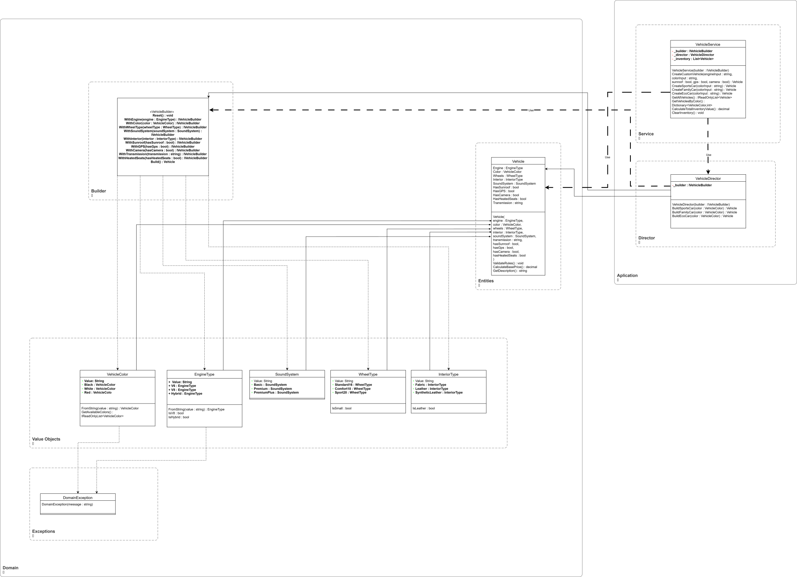
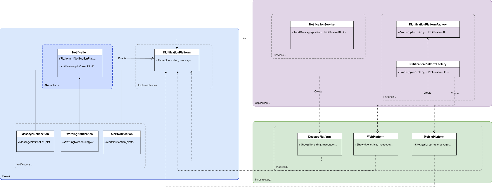
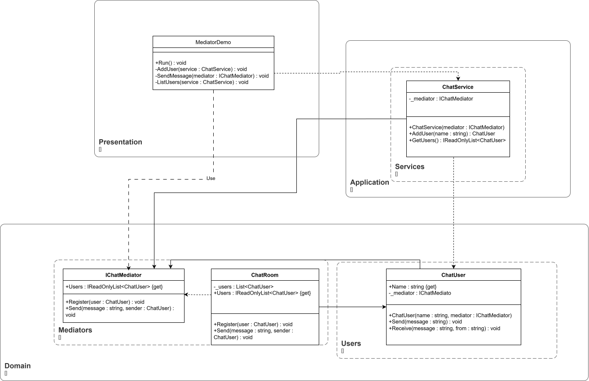

# Unisabana – Patrones de diseño Demo  
**Arquitectura de Software I**

Este proyecto es una **aplicación de consola desarrollada en C#** cuyo objetivo es demostrar la aplicación práctica de **patrones de diseño**, implementados siguiendo los principios de **Arquitectura Limpia (Clean Architecture)** y **SOLID**.

La solución está organizada por **escenarios**, donde cada uno aborda un problema común de diseño de software y muestra cómo un patrón específico permite resolverlo de manera clara, escalable y mantenible.

## 👥 Integrantes

- **José del Carmen Manrique Cruz**
- **José Antonio Leao Ferrer**
- **Samuel Giovanni Colmenares Patiño**
- **Diego Fernando Ramírez Tenjo**

---

## Patrones implementados

1. **Builder** – Construcción de objetos complejos paso a paso  
2. **Bridge** – Separación entre abstracción e implementación  
3. **Mediator** – Comunicación desacoplada entre objetos  

Cada patrón se implementa respetando la separación de responsabilidades y buenas prácticas de diseño orientado a objetos.

#

---

## Escenario 1 – Compañía Automotriz (Builder)

### Problema
La creación de vehículos con múltiples combinaciones de características generaba constructores extensos, difíciles de leer y mantener.

### Solución
Se implementa el **patrón Builder**, separando:
- El proceso de construcción
- El objeto final

### Componentes principales
- `Vehicle`
- `IVehicleBuilder`
- `VehicleBuilder`
- `VehicleDirector`
- `VehicleService`
- `VehicleDemo`

### Beneficios
- Construcción paso a paso
- Código más claro y mantenible
- Fácil extensión de configuraciones de vehículos

### Diagrama de clases

---

## Escenario 2 – Notificaciones Multiplataforma (Bridge)

### Problema
La combinación de tipos de notificación (mensaje, alerta, advertencia) con distintas plataformas (web, móvil, escritorio) generaba una explosión de clases.

### Solución
Se implementa el **patrón Bridge**, separando:
- El tipo de notificación (abstracción)
- La plataforma de visualización (implementación)

Se complementa con **Factory Method** para desacoplar la creación de plataformas de la interfaz de usuario.

### Componentes principales
- `Notification` (abstracción)
- `MessageNotification`
- `AlertNotification`
- `WarningNotification`
- `INotificationPlatform`
- `WebPlatform`
- `MobilePlatform`
- `DesktopPlatform`
- `NotificationPlatformFactory`
- `NotificationService`

### Beneficios
- Cambio de plataforma en tiempo de ejecución
- Eliminación de la explosión de clases
- Cumplimiento de OCP y DIP
- Mayor flexibilidad y mantenibilidad

### Diagrama de clases

---

## Escenario 3 – Sistema de Chat (Mediator)

### Problema
Los usuarios del chat se comunicaban directamente entre sí, creando una red compleja de dependencias difíciles de mantener y escalar.

### Solución
Se implementa el **patrón Mediator**, centralizando la comunicación en un objeto intermediario (sala de chat).

### Componentes principales
- `IChatMediator`
- `ChatRoom` 
- `ChatUser`
- `ChatService`
- `MediatorDemo`

### Beneficios
- Los usuarios no se conocen entre sí
- Comunicación centralizada
- Fácil agregar o eliminar usuarios
- Reducción del acoplamiento
- Mejor organización del código

---

### Diagrama de clases

---

## Interfaz por consola

La aplicación cuenta con un **menú principal** que permite navegar entre los diferentes escenarios:
Las clases Demo no forman parte del diagrama ya que son de prueba para la capa de presentación.

